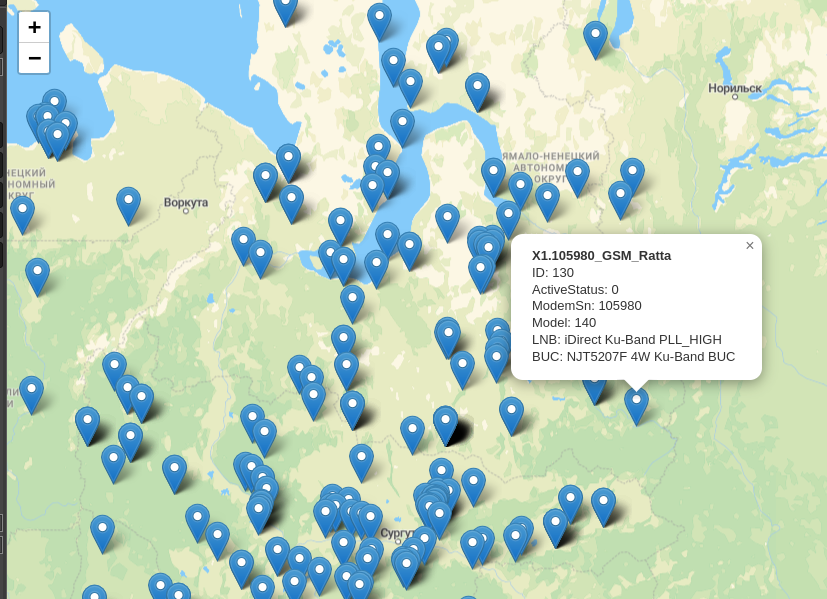

# Satellite Network Modem Map

Satellite Network Modem Map is a Golang application that displays satellite modems of iDirect network on a geo map. The information about the modems is obtained from the NMS database. The application supports connecting to multiple NMS databases if multiple satellite hubs are present.



## Features

- Display satellite modems on a geo map
- Obtain information from the NMS database
- Connect to multiple NMS databases

## Roadmap

- Add SNMP support to obtain information from NMS
- Obtain information from iVantage API
- Display status and active information of modems (temperature, signal level, etc.)

## Getting Started

### Prerequisites

- Golang
- MySQL database

### Installation

1. Clone the repository: `git clone https://github.com/vagabundor/modem-map.git`
2. Navigate to the cloned directory: `cd modem-map`
3. Install dependencies: `go mod tidy`
4. Edit `config.toml` and update the database configuration with your own settings
5. Build the application: `go build -o modem-map cmd/main.go`

## Usage

To start the application, run the following command in the terminal:

```
./modem-map --config=../internal/config.toml
```

Please note that a `map.html` file must be located in the `internal/templates` directory specified in the configuration.

## License

This project is licensed under the MIT License - see the [LICENSE](LICENSE) file for details.
